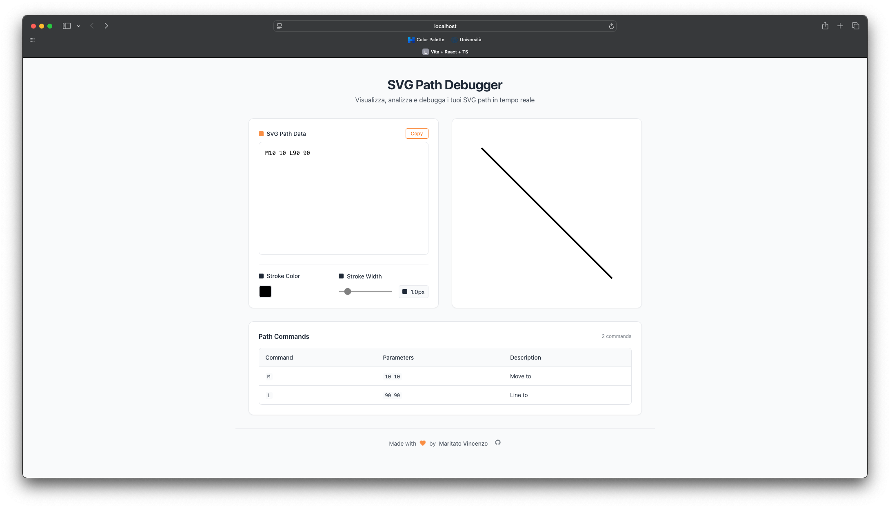

# SVG Path Debugger

[](https://opensource.org/licenses/MIT)
[](http://makeapullrequest.com)
[](https://www.typescriptlang.org/)
[](https://reactjs.org/)
[](https://vitejs.dev/)

A modern, interactive tool for visualizing and debugging SVG paths in real-time. Built with React and TypeScript, this application provides an intuitive interface for working with SVG path data.



## ✨ Features

- **Real-time Visualization**: See your SVG path updates instantly as you type
- **Command Breakdown**: Detailed view of each path command with parameters
- **Interactive Debugging**: Click on commands to highlight them in the preview
- **Color Customization**: Adjust stroke color and width in real-time
- **Error Detection**: Immediate feedback on invalid path data
- **Responsive Design**: Works seamlessly on all device sizes
- **Copy to Clipboard**: One-click copy of path data
- **Auto-resizing**: Automatically fits large SVGs to the preview container

## 🚀 Getting Started

### Prerequisites

- Node.js (v14 or higher)
- npm or yarn

### Installation

1. Clone the repository:

```bash
git clone https://github.com/vmaritato/svg-path-debugger.git
cd svg-path-debugger
```

2. Install dependencies:

```bash
npm install
# or
yarn install
```

3. Start the development server:

```bash
npm run dev
# or
yarn dev
```

4. Open [http://localhost:5173](http://localhost:5173) in your browser

## 🛠️ Usage

1. Enter SVG path data in the input field
2. Watch the preview update in real-time
3. Use the color picker and stroke width slider to customize the appearance
4. Click on commands in the table to highlight them in the preview
5. Copy the path data with the "Copy" button

## 🎨 Example Paths

Try these example paths to get started:

```
M10 10 L90 90
M20 20 C40 20 60 40 80 40
M50 50 A30 30 0 1 1 50 49.9
```

## 🛠️ Built With

- [React](https://reactjs.org/) - UI Library
- [TypeScript](https://www.typescriptlang.org/) - Type Safety
- [Vite](https://vitejs.dev/) - Build Tool
- [SVG](https://developer.mozilla.org/en-US/docs/Web/SVG) - Vector Graphics

## 🤝 Contributing

Contributions are welcome! Please read our [Contributing Guide](CONTRIBUTING.md) for details on our code of conduct and the process for submitting pull requests.

## 📝 License

This project is licensed under the MIT License - see the [LICENSE](LICENSE) file for details.

## 👨‍💻 Author

- **Vincenzo Maritato** - [vmaritato.dev](https://vmaritato.dev)

## 🔒 Security

If you discover any security-related issues, please email [vincenzo.maritato@gmail.com](mailto:vincenzo.maritato@gmail.com) instead of using the issue tracker.

## 🙏 Acknowledgments

- SVG Path specification
- React community
- Open source contributors
